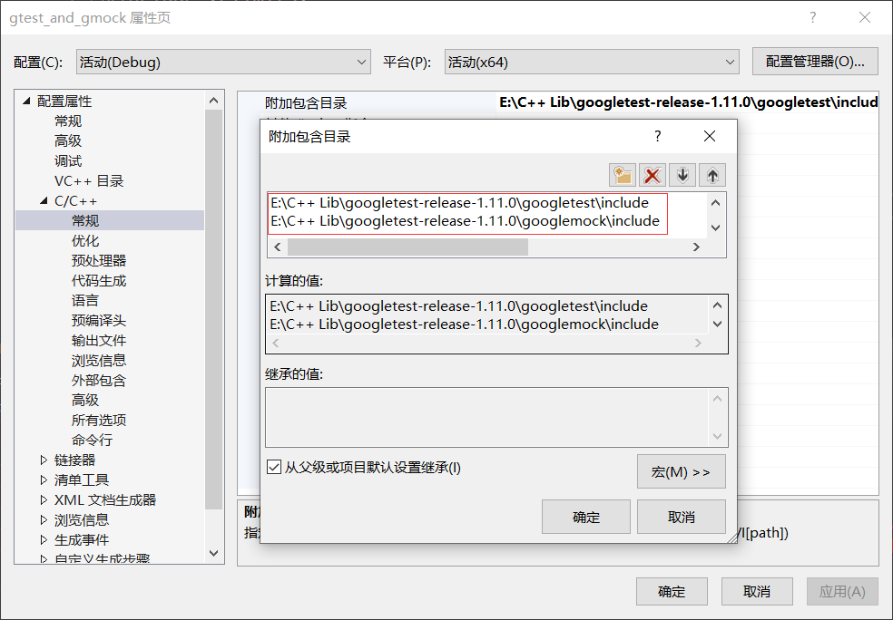
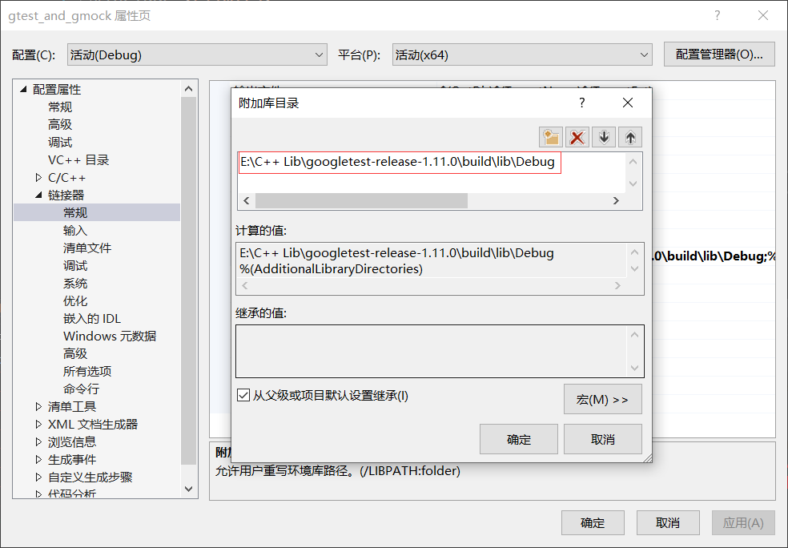
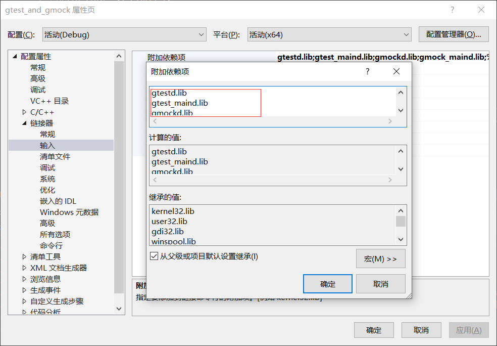
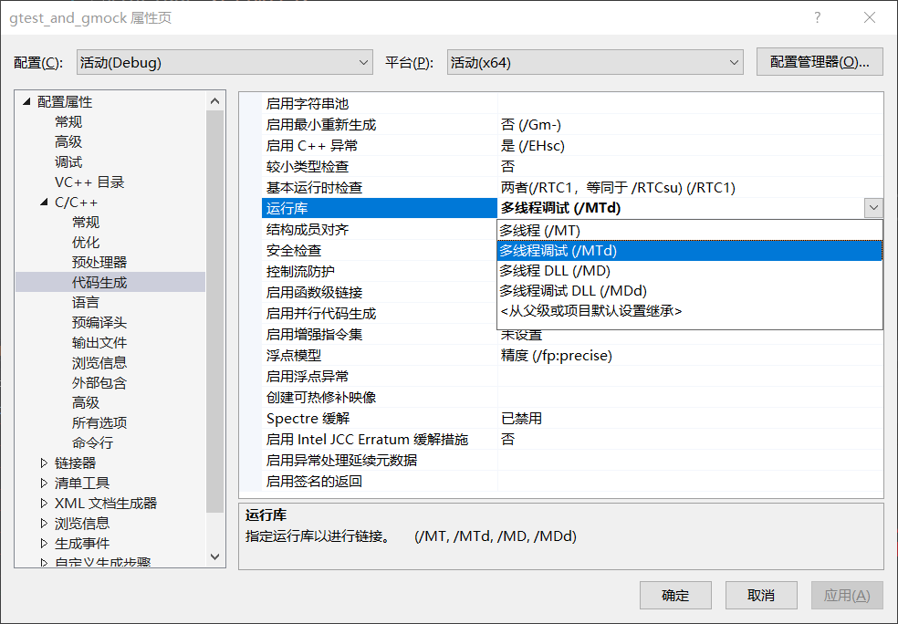
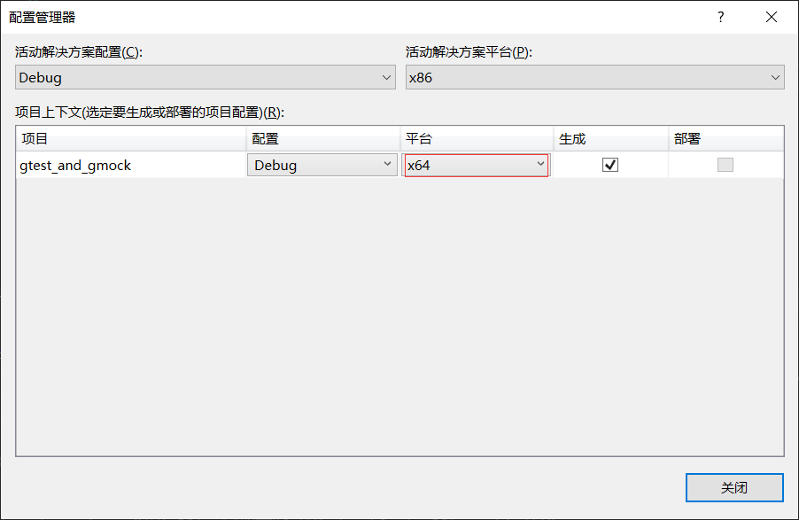

## Visual Studio导入GTest和GMock

**1、创建空项目**

**2、添加gtest和gmock的include目录**



**3、添加链接库目录**



**4、手动添加静态库**

将3目录中所有lib文件加入



==问题：为什么3添加库目录后还需要手动添加？，应该和动态/静态库没关系吧，boost也是使用静态库，但是就不需要手动添加==

**5、设置链接库类型（静态库）**



==为什么boost库也是静态库，就不需要设置？==

**设置项目运行平台**

gtest和gmock的库只适用在x64平台上运行的项目，通过`生成->配置管理器`配置：



==问题：解决方案平台和项目平台的区别？==

# Google Test

## 测试的三个层面

在单元测试中，我们经常需要在某个测试用例、测试套件或整个测试中进行前置操作和运行结束之后的操作，在getest中称之为`事件机制`，gtest将事件按不同作用域划分成三个层次

1. 整个测试层面，即在测试工程开始前和结束后进行；
2. 测试套件层面，即在某个测试套件开始前和结束后进行；
3. 测试用例层面，即在某个测试用例开始前和结束后进行；

**测试层面事件实现**

要实现测试层面的事件，我们需要继承`testing::Environment`类，首先我们来看一下这个类的定义： 

```c++
class Environment {  
 public:  
  virtual ~Environment() {}  
  
  // Override this to define how to set up the environment.  
  virtual void SetUp() {}  
  
  // Override this to define how to tear down the environment.  
  virtual void TearDown() {}  
 private:  
  struct Setup_should_be_spelled_SetUp {};  
  virtual Setup_should_be_spelled_SetUp* Setup() { return NULL; }  
}; 
```

我们要测试的类需要继承该类，其中在SetUp方法中实现所有测试启动之前需要完成的操作，而TearDown函数中实现所有测试运行结束后需要进行的操作

```c++
class FooEnvironment: public testing::Environment
{
    public:
        virtual void SetUp()
        {
            printf("Environment SetUp!\n");
            a = 100;
        }
        virtual void TearDown()
        {
            printf("Environment TearDown!\n");
        }
        int a;     //共享数据
};
FooEnvironment* foo_env;  //对象指针声明
TEST(firstTest, first)    //访问共享数据并改变它的值
{
    printf("in the firstTest, foo_env->p is %d\n", foo_env->a);
    foo_env->a ++;
}
TEST(secondTest, second)  //访问共享数据
{
    printf("in the secondTest, foo_env->p is %d\n", foo_env->a);
}
```

此外，我们还需要编写`main`函数并对`GlobalEnvent`进行注册，然后返回`RUN_ALL_TESTS()`，这里照抄就行

```c++
int main(int argc, char* argv[])
{
    foo_env = new FooEnvironment;
    testing::AddGlobalTestEnvironment(foo_env);     //注册
    testing::InitGoogleTest(&argc, argv);
    return RUN_ALL_TESTS();
}
```

**测试用例事件实现**

要实现单个测试用例的事件，我们需要继承`testing::Test`类，并实现它的`protected virtual`方法`SetUp`和`TearDown`

和前面的`TEST`不同，`TEST_F`的第一个参数必须是继承`testing::Test`的对象

```c++
class FooTest : public ::testing::Test {
 protected:
  void SetUp() {
	...
  }
  void SetUp() {
	...
  }
};

TEST_F(FooTest, Test1) {
  ... you can refer to shared_resource here ...
}
TEST_F(FooTest, Test2) {
  ... you can refer to shared_resource here ...
}
```

在每个测试用例执行前都会调用`SetUp()`，执行后调用`TearDown`

**测试套件事件实现**

要在测试套件层面上定义事件，我们同样需要继承`testing::Test`类，并覆盖它的静态方法：`SetUpTestCase`和`TearDownTestCase`

getest将`TEST_F`中第一个参数相同的分为一个组

```c++
class FooTest : public ::testing::Test {
 protected:
  static void SetUpTestCase() {
    shared_resource_ = new ...;
  }
  static void TearDownTestCase() {
    delete shared_resource_;
    shared_resource_ = NULL;
  }
  // You can define per-test set-up and tear-down logic as usual.
  virtual void SetUp() { ... }
  virtual void TearDown() { ... }

  // Some expensive resource shared by all tests.
  static T* shared_resource_;
};

T* FooTest::shared_resource_ = NULL;

TEST_F(FooTest, Test1) {
  ... you can refer to shared_resource here ...
}
TEST_F(FooTest, Test2) {
  ... you can refer to shared_resource here ...
}
```

在测试程序执行时，gtest在组内第一个测试实例运行之前调用`SetUpTestCase()`，在组内最后一个测试实例运行之后调用`TearDownTestCase()`

**总结**

* TEST_F用于区分组，因此继承`testing::environment`的类不能使用TEST_F进行测试
* 一般将初始化操作放入SetUp函数中，而资源回收等操作方在TearDown函数
* 在以下情况，不适合使用测试用例层面的实现
  * 初始化数据涉及内存申请等操作，为每个测试实例构造对象将带来较大系统开销
  * 存在某数据，其在每个实例中均被用到，但每个实例都不会更改该数据的值

**参考**

[google test入门](https://blog.csdn.net/weixin_43856003/article/details/105833925?utm_medium=distribute.pc_relevant.none-task-blog-2~default~baidujs_title~default-0.control&spm=1001.2101.3001.4242)

[environment用法](https://www.cnblogs.com/bangerlee/archive/2011/10/19/2216006.html)

[gtest中测试的层次](https://blog.csdn.net/carolzhang8406/article/details/54668319)


# 从头到脚说单测

https://mp.weixin.qq.com/s/okmWMOeBm7cCIZ1zzFr4KQ
