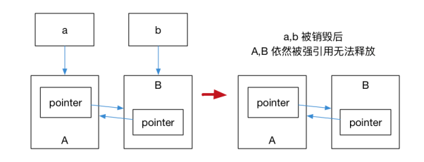
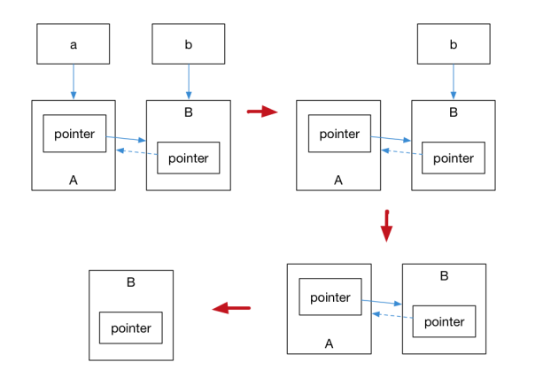

## 基础

### const

**const+基本数据类型**

```cpp
const int bufSize = 512;
```

1、const修饰的类型可见范围为file，如果要外部文件可见，需要加上`extern`

2、由于const修饰后不可修改，所以初始化时就要赋值

**const+结构体/数组**

```cpp
const int intArr[] = { 1, 2, 3 };
struct SI
{
	int i1;
	int i2;
};
const SI s[] = { {1,2},{3,4} };
```

编译时分配空间，所以不存在类似`int temp[cntIntArr[2]]`的表达式，编译器会报告不能找到常量表达式（此时还未分配内存）

**const+引用**

==指向const对象的引用==

1、const引用可以指向普通/const对象，但是不能通过该引用修改对象

2、普通引用不能指向const对象

```cpp
const int ii = 456;
int &rii = ii; // error
int jj = 123;
const int &rjj = jj; // ok
```

1、普通引用只能绑定到同类型，const引用可以绑定字面量、右值、相关类型

```cpp
1.const int &r = 100; // 绑定到字面值常量
2.int i = 50;
const int &r2 = r + i; // 引用r绑定到右值
3.double dVal = 3.1415;
const int &ri = dVal; // 整型引用绑定到double 类型
```

**const+指针**

```cpp
int const *p = &a; // 修饰*p，即p指向的内容不能变

int* const p = &a; // 修饰p，即指针p的值不能变
```


**const修饰类成员函数**

不允许对类的数据成员进行修改


参考：https://www.toutiao.com/i6644404128439075332/?wid=1627874968425


### =的重载

**拷贝构造**


**返回时也会调用=**


### &&符号


### 左值和右值

区分表达式的左右值属性有一个简便方法：若可对表达式用 & 符取址，则为左值，否则为右值。比如

```c++
&obj , &*ptr , &ptr[index] , &++x // 有效

&1729 , &(x + y) , &std::string("meow"), &x++ // 无效
```


参考：https://www.zhihu.com/question/26203703/answer/32414423


## using

- 可以引入命名空间，命名空间中的类


## 动态内存

* 普通对象离开作用域后，就会触发构造函数，然后释放内存
* new出来的对象只能等程序结束后和程序一起释放内存（此时程序已经结束，无法在释放前调用析构）

## 面向对象


c++ 类成员变量默认值分别是多少？（普通成员，string成员，对象成员）

共享指针shared_ptr

引入一个头文件，那么该头文件里面引入的头文件也会被引入


## 回调

使用`C++ std::function`来充当回调函数，可通过`Lambda`表达式、仿函数、函数指针来构造`function`对象

### Lambda

参考：https://www.jianshu.com/p/d686ad9de817

**不带参数/返回值**

```cpp
// 定义简单的lambda表达式
auto basicLambda = [] { cout << "Hello, world!" << endl; };
// 调用
basicLambda();   // 输出：Hello, world!
```


**带参数/返回值**

```cpp
// 指明返回类型
auto add = [](int a, int b) -> int { return a + b; };
// 自动推断返回类型
auto multiply = [](int a, int b) { return a * b; };

int sum = add(2, 5);   // 输出：7
int product = multiply(2, 5);  // 输出：10
```

### 仿函数

```c++
struct MyPlus{
    int operator()(const int &a , const int &b) const{
        return a + b;
    }
};

int main()
{
    MyPlus a;
    cout << MyPlus()(1,2) << endl;　　　　//1、通过产生临时对象调用重载运算符
    cout << a.operator()(1,2) << endl;  //2、通过对象显示调用重载运算符
    cout << a(1,2) << endl;　　　　　　   //3、通过对象类似函数调用 隐示地调用重载运算符
    return ;
}
```

**greater简易实现**

```c++
struct greater
{
    bool operator() (const int& iLeft, const int& iRight)
    {
        return (iLeft > iRight);//如果是实现less<int>的话，这边是写return (iLeft<iRight);
    }
};

int main()
{
    int a,b;
    a = , b = ;
 
    if (greater()(a, b))
        cout << "a>b";
    else
        cout << "a<b";
 
    system("pause");
    return ;
}
```


参考：https://www.shuzhiduo.com/A/l1dyVkM6ze/

### C++ std::function的用法

**使用**

```c++
#include <iostream>
#include <vector>
#include <list>
#include <map>
#include <set>
#include <string>
#include <algorithm>
#include <functional>
#include <memory>
using namespace std;
 
//声明一个模板
typedef std::function<int(int)> Functional;
 
 
//normal function
int TestFunc(int a)
{
    return a;
}
 
//lambda expression
auto lambda = [](int a)->int{return a;};
 
//functor仿函数
class Functor
{
public:
    int operator() (int a)
    {
        return a;
    }
};
 
 
//类的成员函数和类的静态成员函数
class CTest
{
public:
    int Func(int a)
    {
        return a;
    }
    static int SFunc(int a)
    {
        return a;
    }
};
 
 
int main(int argc, char* argv[])
{
    //封装普通函数
    Functional obj = TestFunc;
    int res = obj(0);
    cout << "normal function : " << res << endl;
 
    //封装lambda表达式
    obj = lambda;
    res = obj(1);
    cout << "lambda expression : " << res << endl;
 
    //封装仿函数
    Functor functorObj;
    obj = functorObj;
    res = obj(2);
    cout << "functor : " << res << endl;
 
    //封装类的成员函数和static成员函数
    CTest t;
    obj = std::bind(&CTest::Func, &t, std::placeholders::_1);
    res = obj(3);
    cout << "member function : " << res << endl;
 
    obj = CTest::SFunc;
    res = obj(4);
    cout << "static member function : " << res << endl;
 
    return 0;
}
```

对各种可调用实体统一封装（普通函数、lambda表达式、函数指针等），形成一个新的std::function对象，让用户不再纠结可调用实体类型


**总结**

* 一般用于函数回调
* 关于可调用实体转换为`std::function`对象需要遵守以下两条原则
  - 转换后的`std::function`对象的参数能转换为可调用实体的参数
  - 可调用实体的返回值能转换为`std::function`对象的返回值


参考：https://blog.csdn.net/zeqi1991/article/details/73727458?locationNum=8&fps=1#

### 函数指针


参考：https://www.runoob.com/w3cnote/cpp-func-pointer.html


## 信号处理


## 重载

### 重载()

```c++
#include <iostream>
using namespace std;

class Distance
{
private:
	int feet;             // 0 到无穷
	int inches;           // 0 到 12
public:
	// 所需的构造函数
	Distance() {
		feet = 0;
		inches = 0;
	}
	Distance(int f, int i) {
		feet = f;
		inches = i;
	}
	// 重载函数调用运算符
	Distance operator()(int a, int b, int c)
	{
		Distance D;
		// 进行随机计算
		D.feet = a + c + 10;
		D.inches = b + c + 100;
		return D;
	}
	// 显示距离的方法
	void displayDistance()
	{
		cout << "F: " << feet << " I:" << inches << endl;
	}

};
int main()
{
	Distance D1(11, 10), D2;

	cout << "First Distance : ";
	D1.displayDistance();

	D2 = D1(10, 10, 10); // invoke operator()
	cout << "Second Distance :";
	D2.displayDistance();

	return 0;
}
```


注意和仿函数的区别==？==

## 模板

### 模板参数包

- `可变参数模板(variadic template)`为一个接受可变数目参数的模板函数或模板类。
- `参数包(parameter packet)`可变数目的参数。
- `模板参数包(template parameter packet)`表示零个或多个模板参数。
- `函数参数包(function parameter packet)`表示零个或多个函数参数。

**使用sizeof获取参数包中参数个数**

```c++
template <typename T, typename... Args>
void foo(const T& t, const Args&... rest)
{
    std::cout << sizeof...(Args) << std::endl;
    std::cout << sizeof...(rest) << std::endl;
}
int main()
{
    int i = 0;
    double d = 3.14;
    string s = "haha";
    foo(i, s, 42, d); // 3 ,3 
    foo(s, 42, "hoi"); // 2, 2
    foo(d,s); // 1, 1
    foo("hihihi"); // 0, 0
    foo(d,"asdf", "asdfasdf"); // 2, 2
    // 这五种调用会实例化出五个不同版本的foo().
}
```


**模板参数->函数->类**

```c++
/**
 * 异步并发调用，无返回值
 */
template<typename Signature>
class AsyncSignal;

template<typename... Args>
class AsyncSignal<void(Args...)> // 创建信号时指定信号要连接的回调
{
public:
    /**
     * @brief 把回调函数连接到信号
     *
     * @param callback 回调函数
     * @param executor 执行回调的executor
     *
     * @return SignalConnection
     */
    template<typename... TaskArgs>
    SignalConnection Connect(const std::function<void(Args...)>& , const ExecutorPtr& executor,
                             TaskArgs&&... taskArgs)
    {
    }

    /**
     * @brief 触发信号
     *
     * @param args 信号参数
     */
    void operator()(Args... args) const
    {
    }

protected:
    BasicSignal<void(Args...)> m_signal;
};
```


**总结**

调用模板参数包时的参数类型可以不同


参考：https://zhuanlan.zhihu.com/p/149405532


## Fiber


## C++中文参考手册

https://www.apiref.com/cpp-zh/index.html


## 现代C++

### 语言运行期的强化

#### Lambda表达式

Lambda就是匿名函数，在我们需要一个函数，但是又不想对函数命名时使用

**基本语法**

```c++
[捕获列表](参数列表) mutable(可选) 异常属性 -> 返回类型 {
// 函数体
}
```

由于表达式不能使用函数外的变量，`[捕获列表]`的作用就是传递外部变量，捕获列表分为以下几种：

**值传递**

在==表达式创建时==对捕获的值进行拷贝（注意，这里属于初始化），相当于捕获当前变量的快照

```c++
void lambda_value_capture() {
    int value = 1;
    auto copy_value = [value] {
        return value;
    };
    value = 100;
    auto stored_value = copy_value();
    std::cout << "stored_value = " << stored_value << std::endl;
    // 这时, stored_value == 1, 而 value == 100.
    // 因为 copy_value 在创建时就保存了一份 value 的拷贝
}
```


**引用传递**

捕获的时变量的引用，使用的是调用表达式时变量的值

```c++
void lambda_reference_capture() {
    int value = 1;
    auto copy_value = [&value] {
        return value;
    };
    value = 100;
    auto stored_value = copy_value();
    std::cout << "stored_value = " << stored_value << std::endl;
    // 这时, stored_value == 100, value == 100.
    // 因为 copy_value 保存的是引用
}
```


**隐式捕获**

捕获列表只写`[&]`，编译器会自行推导捕获的引用（函数体内使用到的引用）

捕获列表只写`[=]`，编译器会自行推导捕获的变量（函数体内使用到的变量）

**捕获表达式/右值**

以上3种方法捕获的都是左值（可以取地址），实际上表达式也可以捕获右值（不可以取地址）

```c++
#include <iostream>
#include <utility>
int main() {
    auto important = std::make_unique<int>(1);
    auto add = [v1 = 1, v2 = std::move(important)](int x, int y) -> int {
        return x+y+v1+(*v2);
    };
    std::cout << add(3,4) << std::endl;
    return 0;
}
```

 `important`是独占指针，是不能用`[important]`捕获，因为这样执行的是初始化，独占指针只能进行转移

`v1`和`v2`会像`const`一样自动判断类型

### 容器

### 智能指针和内存管理

#### std::shard_ptr

一种智能指针，能记录有多少个shard_ptr共同指向一个对象

```c++
#include <iostream>
#include <memory>
void foo(std::shared_ptr<int> i)
{
(*i)++;
}
int main()
{
// auto pointer = new int(10); // illegal, no direct assignment
// Constructed a std::shared_ptr
auto pointer = std::make_shared<int>(10);
foo(pointer);
std::cout << *pointer << std::endl; // 11
// The shared_ptr will be destructed before leaving the scope
return 0;
}
```

通过`get`方法获取原始指针，通过`reset`重置当前指针（即不再指向该对象），通过`use_count()`获取一个对象的指针计数

```c++
auto pointer = std::make_shared<int>(10);
auto pointer2 = pointer; // 引用计数 +1
auto pointer3 = pointer; // 引用计数 +1
int *p = pointer.get(); // 这样不会增加引用计数
std::cout << "pointer.use_count() = " << pointer.use_count() << std::endl; // 3
std::cout << "pointer2.use_count() = " << pointer2.use_count() << std::endl; // 3
std::cout << "pointer3.use_count() = " << pointer3.use_count() << std::endl; // 3
pointer2.reset();
std::cout << "reset pointer2:" << std::endl;
std::cout << "pointer.use_count() = " << pointer.use_count() << std::endl; // 2
std::cout << "pointer2.use_count() = " << pointer2.use_count() << std::endl; // 0, pointer2 已 reset
std::cout << "pointer3.use_count() = " << pointer3.use_count() << std::endl; // 2
pointer3.reset();
std::cout << "reset pointer3:" << std::endl;
std::cout << "pointer.use_count() = " << pointer.use_count() << std::endl; // 1
std::cout << "pointer2.use_count() = " << pointer2.use_count() << std::endl; // 0
std::cout << "pointer3.use_count() = " << pointer3.use_count() << std::endl; // 0, pointer3 已 reset
```


**有生命周期**

```c++
#include <memory>
#include <iostream>
void foo(std::shared_ptr<int>& pointer)
{
	std::cout << pointer.use_count() << std::endl; // 2
	auto p1 = pointer;
	std::cout << pointer.use_count() << std::endl; // 3
}
int main()
{
	auto pointer = std::make_shared<int>(10);
	std::cout << pointer.use_count() << std::endl; // 1
	auto p1 = pointer;
	foo(pointer);
	// The shared_ptr will be destructed before leaving the scope
	std::cout << pointer.use_count() << std::endl; // 2

	return 0;
}
```


#### std::unique_ptr

独占指针，不能有多个unique_ptr指向一个对象（不考虑其它类型指针），但是可以转移给其他unique_ptr

```c++
std::unique_ptr<int> pointer = std::make_unique<int>(10); // make_unique 从 C++14 引入
std::unique_ptr<int> pointer2 = pointer; // 非法
```


**利用move将对象转移给其它unique_ptr**

```c++
#include <iostream>
#include <memory>
struct Foo {
	Foo() { std::cout << "Foo::Foo" << std::endl; }
	~Foo() { std::cout << "Foo::~Foo" << std::endl; }
	void foo() { std::cout << "Foo::foo" << std::endl; }
};
void f(const Foo&) {
	std::cout << "f(const Foo&)" << std::endl;
}
int main() {
	std::unique_ptr<Foo> p1(std::make_unique<Foo>());
	// p1 不空, 输出
	if (p1) p1->foo();
	{
		std::unique_ptr<Foo> p2(std::move(p1));
		// p2 不空, 输出
		f(*p2);
		// p2 不空, 输出
		if (p2) p2->foo();
		// p1 为空, 无输出
		if (p1) p1->foo();
		p1 = std::move(p2);
		// p2 为空, 无输出
		if (p2) p2->foo();
		std::cout << "p2 被销毁" << std::endl;
	}
	// p1 不空, 输出
	if (p1) p1->foo();
	// Foo 的实例会在离开作用域时被销毁
}
```


#### std::weak_ptr

**shared_ptr循环指向问题**

```c++
#include <iostream>

struct A;
struct B;
struct A {
	std::shared_ptr<B> pointer;
	~A() {
		std::cout << "A 被销毁" << std::endl;
	}
};
struct B {
	std::shared_ptr<A> pointer;
	~B() {
		std::cout << "B 被销毁" << std::endl;
	}
};
int main() {
	auto a = std::make_shared<A>();
	auto b = std::make_shared<B>();
	a->pointer = b;
	b->pointer = a;
	return 0;
}
```

在作用域内，A、B的引用数都是2

离开作用域后，a、b被析构，会分别取消指向A、B，但是A对象里面的pointer还指向B，B同理，他们的引用数都为1，无法被回收




可以将A或B内随意一个pointer替换成weak_ptr，weak_ptr不影响引用数



最后只剩下B，由于此时B的引用数为0，所以之后也会被回收


**weak_ptr用法**

weak_ptr不影响所指对象的生命周期，可以用weak_ptr获取其所指对象的引用数

```c++
#include <memory>
#include <string>
#include <iostream>
#include <memory>
using namespace std;

int main()
{
    //default consstructor
    weak_ptr<string> wp;

    {
        shared_ptr<string> p = make_shared<string>("hello world!\n");
        //weak_ptr对象也绑定到shared_ptr所指向的对象。
        wp = p;
        cout << "use_count: " << wp.use_count() << endl;
    	// 出去后p所指向对象引用数为0，会被释放
    }
    //wp是弱类型的智能指针，不影响所指向对象的生命周期，
    //这里p已经析构，其所指的对象也析构了，因此输出是0
    cout << "use_count: " << wp.use_count() << endl;

	return 0;
}
```

**weak_ptr智能指针使用**

```c++
#include <memory>
#include <string>
#include <iostream>
#include <memory>
using namespace std;

void test_valid(weak_ptr<string>& wp)
{
	cout << wp.use_count() << endl; // 1
	if (shared_ptr<string>  smptr2 = wp.lock())
	{
		cout << smptr2.use_count() << endl; // 2
		cout << "the shared_ptr is valid\n";
	}
	else
	{
		cout << "the shared_ptr is not valid\n";
	}

	//检查被引用的对象是否已删除 false 仍存在  true 释放
	if (!wp.expired())
	{
		//it is getting valid shared_ptr obj now;
		shared_ptr<string>  smptr1 = wp.lock();
		cout << "   get obj value: " << *smptr1;
	}
}

int main()
{
	shared_ptr<string> p = make_shared<string>("hello world!\n");

	//default consstructor
	weak_ptr<string> wp1;

	//copy constructor
	weak_ptr<string> wp2(p);

	//assign constructor
	weak_ptr<string> wp3 = wp2;

	test_valid(wp2);

	//释放被管理对象的所有权, 调用后 *this 不管理对象
	wp2.reset();

	test_valid(wp2);

	return 0;
}

```

1、使用wp.lock()获取shared_ptr，会使wp所指对象的shared_ptr加一

2、expired表示对象是否还有效（即是否被释放）


#### enable_shared_from_this


**为什么要有`shared_from_this`**

```c++
#include <iostream>
#include <memory>

class ImChatSendTextCmd final : public std::enable_shared_from_this<ImChatSendTextCmd>
{
public:
	ImChatSendTextCmd(int64_t sid, const std::string& content, const std::string& metadata)
		: m_sid(sid)
		, m_content(content)
		, m_metadata(metadata)
	{
	}
	virtual ~ImChatSendTextCmd() = default;

public:

	virtual void Execute();

private:
	void Check() const;
	int64_t m_sid{0};
	std::string m_content;
	std::string m_metadata;
};

void ImChatSendTextCmd::Execute()
{
	Check();
	// TODO 创建要发送的消息体
	// TODO 保存消息到本地
	std::weak_ptr<ImChatSendTextCmd> wp = shared_from_this();
	auto cb = [wp](const Result& result, const ImMessage& msg) {
		const auto ptr = wp.lock();
		if (!ptr)
		{
			// TODO 抛出ImChatSendTextCmd空指针异常
		}
		if (result.bizCode)
		{
			// TODO 抛出消息发送失败异常
		}
	};
	SendImMessage(msg.msgSeq, cb);
	// TODO 通知UI消息已更新
}

void ImChatSendTextCmd::Check() const
{
	if (!m_sid || m_content.empty() || m_metadata.empty())
	{
		// TODO 抛出异常
	}
}
```

> 因为在异步调用中，存在一个保活机制，异步函数执行的时间点我们是无法确定的，然而异步函数可能会使用到异步调用之前就存在的变量。为了保证该变量在异步函数执期间一直有效，我们可以传递一个指向自身的share_ptr给异步函数，这样在异步函数执行期间share_ptr所管理的对象就不会析构，所使用的变量也会一直有效了（保活）。

拿上面代码举例，调用SendImMessage结束后会调用回调cb，此时如果让cb捕获this指针，那么不敢保证调用cb是this是否为空（即ImChatSendTextCmd对象是否被释放）

所以整个项目采用智能指针，此时我们不手动释放对象，只有引用计数为0时对象才会被自动释放，我们通过为对象创建shared_ptr，确保在cb调用前SendImMessage对象引用计数不为0

参考：

https://changkun.de/modern-cpp/zh-cn/05-pointers/index.html#5-2-std-shared-ptr

https://blog.csdn.net/c_base_jin/article/details/79440999

https://blog.csdn.net/caoshangpa/article/details/79392878

### 杂项

#### noexcept的修饰和操作

**c++11异常分两种情况**

1. 函数可能抛出异常
2. 函数不可能抛出异常

```c++
void may_throw(); // 可能抛出异常
void no_throw() noexcept; // 不可能抛出异常
```

如果被noexcept修饰的函数抛出异常，会被编译器使用 std::terminate() 来立即终止程序运行

**noexcept做操作符**

noexcept做操作符，操作一个表达式，返回true表示表达式无异常，反之返回false

```c++
#include <iostream>
void may_throw() {
throw true;
}
auto non_block_throw = []{
may_throw();
};
void no_throw() noexcept {
return;
}
auto block_throw = []() noexcept {
no_throw();
};
int main()
{
std::cout << std::boolalpha
<< "may_throw() noexcept? " << noexcept(may_throw()) << std::endl // false
<< "no_throw() noexcept? " << noexcept(no_throw()) << std::endl // true
<< "lmay_throw() noexcept? " << noexcept(non_block_throw()) << std::endl // false
<< "lno_throw() noexcept? " << noexcept(block_throw()) << std::endl; // true
return 0;
}
```

**noexcept防止异常扩散**

non_block_throw()调用may_throw()，后者抛出异常如果没有捕获，会被自动抛出non_block_throw()

```c++
int main()
{
	try {
		may_throw();
	}
	catch (...) {
		std::cout << " 捕获异常, 来自 may_throw()" << std::endl; // 该语句会输出
	}
	try {
		non_block_throw();
	}
	catch (...) {
		std::cout << " 捕获异常, 来自 non_block_throw()" << std::endl; // 该语句会输出
	}
	try {
		block_throw();
	}
	catch (...) {
		std::cout << " 捕获异常, 来自 block_throw()" << std::endl; // 该语句不会输出
	}
	return 0;
}
```


## 第三方工具

### 利用auto和std::chrono获取系统时间（C++11）


https://www.jianshu.com/p/170164adae0f
