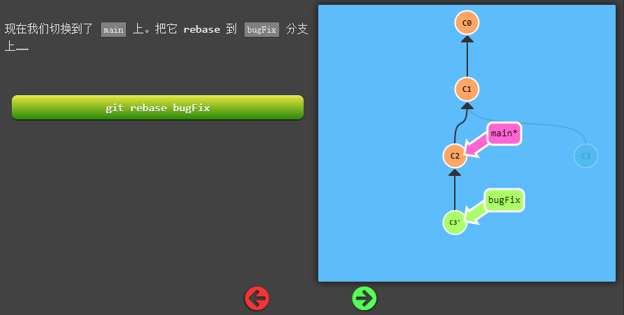
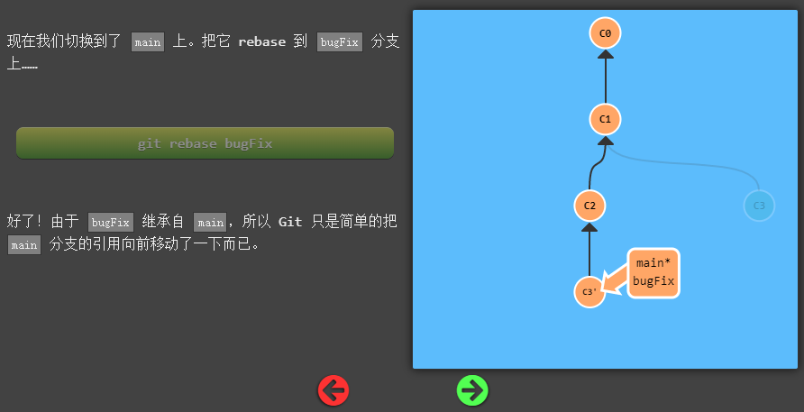

## 学习

### 基础

**commit**

**checkout brach**

**merge**

**rebase**

### 提高

**head**

一般指向分支，分离head即让其指向提交记录

**使用^向上移动**

**使用~向上移动多步**

**git branch -f HEAD~4（强制移动分支）**

**reset只对本地库有效（后面接要回退到的版本）**

**revert对远程库有效（后面接要回退的版本）**

## 问题

* [ ] 为什么？

* [ ] git checkout用于分支和快照（即提交记录）的区别

* [ ] commit一个版本后，push成功，之后发现commit前还有一些修改未保存，于是修改上一个版本的commit，修改成功，此时push会失败，需要先pull后再push，为什么？
* [ ] 查看本地HEAD和远程HEAD分别在哪？

### git fetch和git pull的区别

## 总结

1. commit是提交到本地
2. 远程分支在哪个版本，同步时就拉取（P）哪个版本代码
3. 右边为本地代码，左边为选择对比的分支的代码

## TortoiseGit用法

1. commit是

### 流程

1. 修改
2. 从远程仓库拉取到本地仓库
3. 提交本地仓库
4. 解决冲突（如果有）
5. 提交远程仓库

### 标签

> 首先说一下作用：Git 中的tag指向一次commit的id，通常用来给开发分支做一个标记，如标记一个版本号。
>
> 下面就说一下具体的用法：
>
> 1.添加标签： git tag -a version -m "note"
> 注解：git tag 是打标签的命令，-a 是添加标签，其后要跟新标签号，-m 及后面的字符串是对该标签的注释。
>
> 2.提交标签到远程仓库 ： git push origin -tags
> 注解：就像git push origin master 把本地修改提交到远程仓库一样，-tags可以把本地的打的标签全部提交到远程仓库。
> 3.删除标签： git tag -d version
> 注解：-d 表示删除，后面跟要删除的tag名字
> 4.删除远程标签： git push origin :refs/tags/version
> 注解：就像git push origin :branch_1 可以删除远程仓库的分支branch_1一样， 冒号前为空表示删除远程仓库的tag。
> 5.查看标签： git tag 或者 git tag -l

### 版本分支图

红色：当前所在分支

绿色：本地分支（一般对本地无用分支可以直接删除）

黄色：tag

橙色：远程分支

灰色：合并标示

### 解决冲突

### 分支中的HEAD

## 参考

https://learngitbranching.js.org/?locale=zh_CN

## pull和fetch的区别

https://blog.csdn.net/kunyus/article/details/103610003

### merge合并原理

[https://www.tripod.fun/2020/06/09/2020/git%E5%90%88%E5%B9%B6%E5%8E%9F%E7%90%861/](https://www.tripod.fun/2020/06/09/2020/git合并原理1/)

## rebase和merge的区别

https://www.jianshu.com/p/f23f72251abc

