看能不能针对一些核心点，可以讲点4x的东西，这样文章会比较饱满，然后结合我们应用来讲，其他人听起来也比较有帮助

然后有个小原则是，分享的内容，最好是自己能够讲清楚的，避免个别概念理解的不上不下，到时候讲不清楚反而不好这个原则也适用于你到时候转正答辩，写在ppt上的东西都一定是自己能讲清楚的

## 架构与特性

### 使用者眼中的聊天系统

1. 不同用户创建账号并构成关系链
2. 某个用户的关系用户构成其联系人列表
3. 好友间可以进行消息互动
4. 消息构成一个会话
5. 好友间进入会话后发送消息

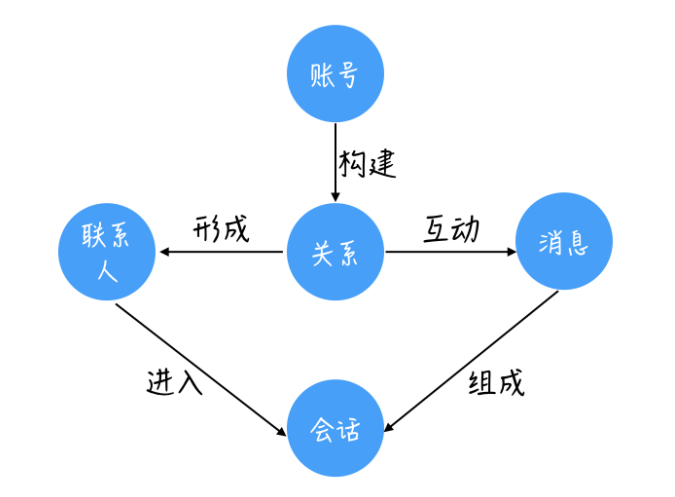

### 开发者眼中的聊天系统

1. 客户端：邮局分拨中心

2. 接入服务：客户端一旦接入系统所享受的服务（每个邮局分拨中心接入邮局都享受的服务）

   还进行编码工作，节省网络传输流量

3. 业务处理服务：类似消息存储、未读数更变、更新最近联系人等

4. 存储服务：进行文件持久化

5. 外部接口服务：有时用户不在线，需要将消息交给第三方外部接口（通知栏 ），等其上线后交给用户

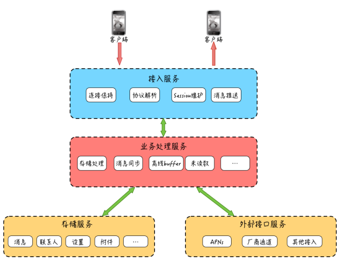

**为什么接入服务和业务处理服务要独立拆分呢？**

1. 业务处理服务由于随着产品需求迭代，变更非常频繁，如果消息收发接入和业务逻辑处理都在一起，势必会让接入模块随着业务逻辑的变更上线，而频繁起停，导致已通过网络接入的客户端连接经常性地断连、重置、重连  
2. 有助于提升业务开发效率，降低业务开发门槛（将编码和协议部分单独处理）

### IM 系统特性

**实时性**

**可靠性**

1. 不丢消息
2. 消息不重复

**一致性**

1. 单聊场景，一致性是指希望发送方的消息发送顺序和接收方的接收顺序保持一致
2. 对于一个群的某一条消息，我们希望群里其他人接收到的消息顺序都是一致的 
3. 同一个用户的多台终端设备，我们希望发送给这个用户的消息在多台设备上也能保持一致性  

**安全性**

1. 数据传输安全
2. 数据存储安全
3. 数据内容安全

## 消息收发架构

给一个系统加上IM功能，需要

1. 高效的手法通道
2. 消息存储

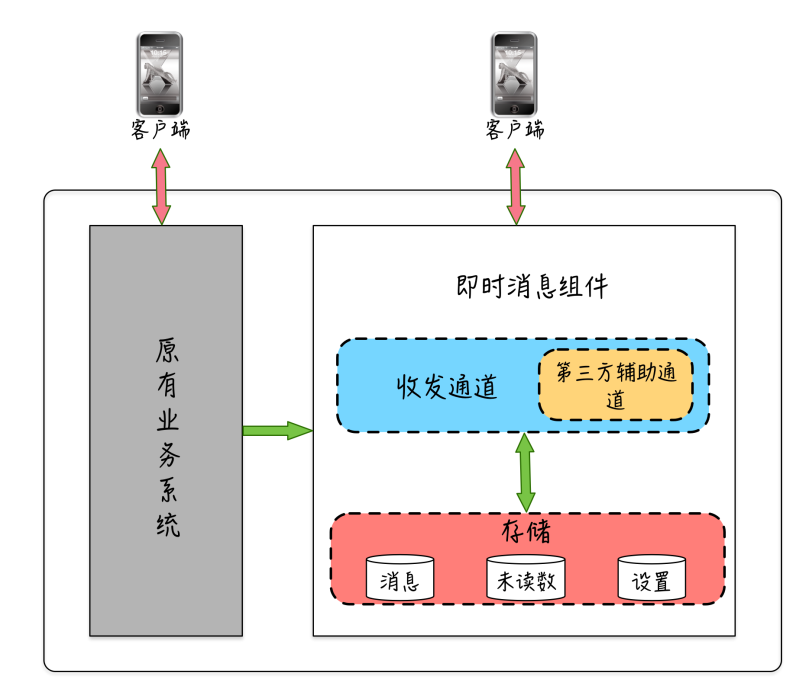

### 消息存储

1. 消息本体
2. 由于发送端将消息删除不会影响接收端接收，所以收发双方需要有各自的索引
3. 联系人列表，用于快速查找最近联系人，一般还会携带两人最新的一条聊天信息

**内容表**

**索引表**

收发双方的两个索引表通过同一个消息 ID 和这个内容表关联 

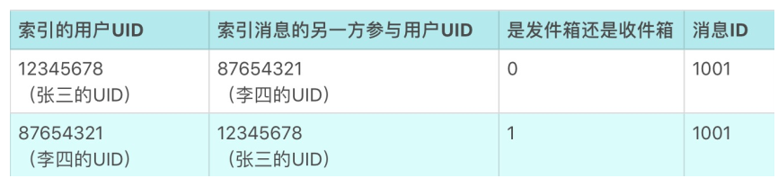

**联系人列表**

最近的联系人可以根据记录更新时间查找

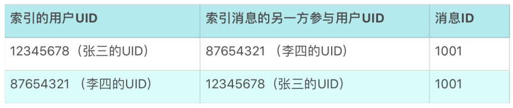

### 消息发送通道

1. IM服务器提供HTTP协议的API接口，客户端调用发送
2. 客户端和 IM 服务端维护一个 TCP 长连接，客户端有消息发送时，会以私有协议来封装这条要发送的消息，然后通过这个 TCP 长连接把消息发给 IM 服务端 

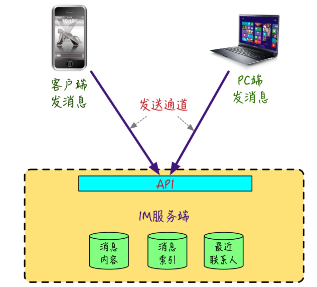

### 消息接收通道

1. TCP长连接是全双工，需保证高可用（当由于网络原因连接被中断时，能快速感知并进行重连等恢复性操作）
2. 长连接需保证可靠性

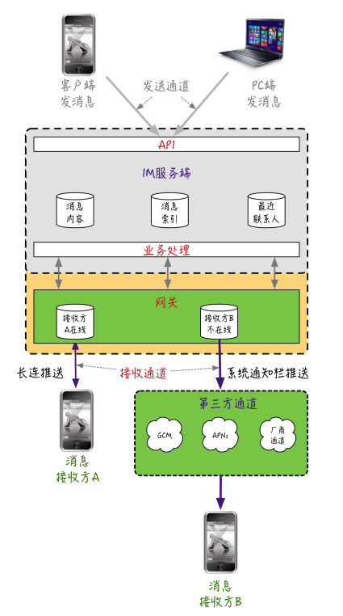

### 消息未读数

> 用过 QQ、微信的用户应该都有一个比较明显的感知，很多时候为了避免通知栏骚扰，会限制掉 App 在通知栏提醒权限，或者并没有注意到通知栏的提醒，这些情况都可能会让我们无法及时感知到“有人给我发了新的消息”这个事情。  

1. 我有多少条未读数
2. 我与某人的会话有多少未读数

**场景模拟**

> 1、张三给李四发送一条消息，IM 服务端接收到这条消息后，给李四的总未读数增加 1，给李四和张三的会话未读也增加 1；
>
> 2、李四看到有一条未读消息后，打开 App，查看和张三的聊天页，这时会执行未读变更，将李四和张三的会话未读减 1，将李四的总未读也减 1。  

## 实时性-轮询与长连接

IM 在追求“消息实时性”的架构上，所经历过的几个代表性阶段

### 短轮询

在 PC Web 的早期时代，对于数据的获取，大部分应用采用一问一答的“请求响应”式模式  

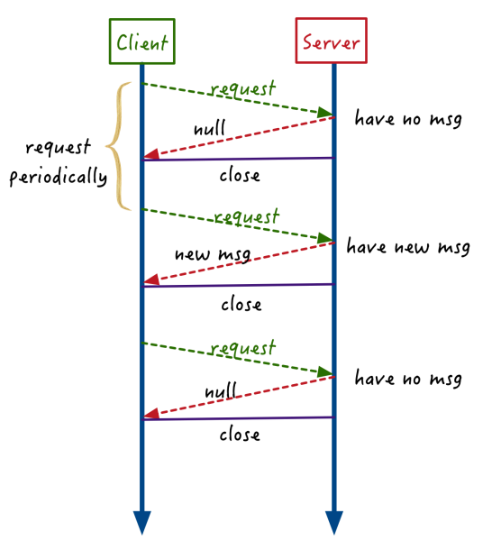

1、短轮询的频率一般较高，但大部分轮询请求实际上是无用的，客户端既费电也费流量

2、高频请求对服务端资源的压力也较大，一是大量服务器用于扛高频轮询的 QPS（每秒查询率），二是对后端存储资源也有较大压力

### 长轮询

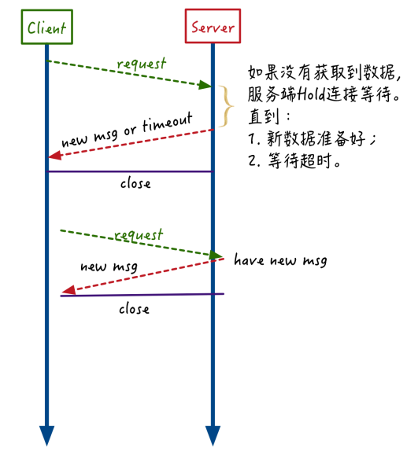

1、服务端悬挂（hang）住请求，只是降低了入口请求的 QPS，并没有减少对后端资源轮询的压力。假如有 1000 个请求在等待消息，可能意味着有 1000 个线程在不断轮询消息存储资源。  

2、长轮询在超时时间内没有获取到消息时，会结束返回，因此仍然没有完全解决客户端“无效”请求的问题。  

### 服务端推送

全双工的 WebSocket 彻底解决了服务端推送的问题（服务端推送技术）

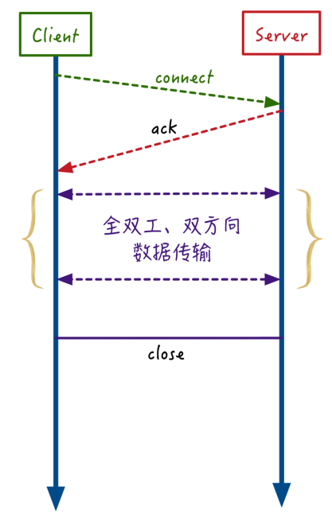

当服务器端有消息时，能实时推送，真正做到边缘触发

### TCP 长连接衍生的 IM 协议 

1. XMPP
2. MQTT
3. 许多大厂选择自建协议

## 可靠性-ACK机制

==服务端路由中转：一条消息从用户 A 发出后，需要先经过 IM 服务器来进行中转，然后再由 IM 服务器推送给用户 B，这个也是目前最常见的 IM 系统的消息分发类型==

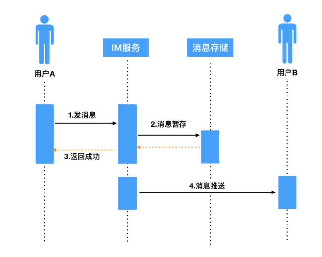

### 消息丢失的几种情况

1、步骤1、2的信息丢失，步骤3的超时回复都有可能使A提示发送失败（步骤3还可能造成消息重复）

2、推送阶段4也有可能造成信息丢失

3、就算推送步骤4成功后，用户B端存储该信息到本地数据库时也有可能造成信息丢失

==针对第一部分，我们通过客户端 A 的超时重发和 IM 服务器的去重机制，基本就可以解决问题
针对第二部分，业界一般参考 TCP 协议的 ACK 机制，实现一套业务层的 ACK 协议==

### 解决丢失的方案：业务层 ACK 机制

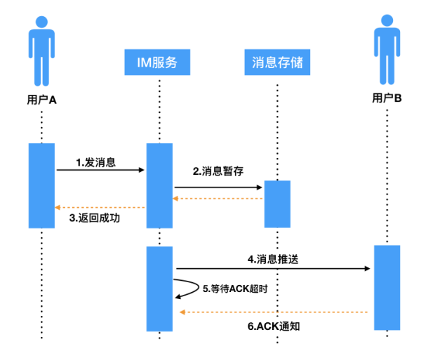

> IM 服务器在推送消息时，携带一个标识 SID（安全标识符，类似 TCP 的 sequenceId），推送出消息后会将当前消息添加到“待 ACK 消息列表”，客户端 B 成功接收完消息后，会给 IM 服务器回一个业务层的 ACK 包，包中携带有本条接收消息的 SID，IM 服务器接收后，会从“待 ACK 消息列表”记录中删除此条消息，本次推送才算真正结束。  

服务端：近期所有消息队列+定时器

### ACK 机制中的消息重传

参考TCP重传机制

IM服务端维护一个“等待ACK队列”，如果队首信息接收到了ACK，那么直接出队；如果超时后还是没有接收到ACK，那么重新推送该信息。

### 消息重复推送的问题 

**收不到ACK有2中情况**

1. 消息真的没送达
2. 返回的ACK丢失

**解决办法**

> 针对这种情况，一般的解决方案是：服务端推送消息时携带一个 Sequence ID，SequenceID 在本次连接会话中需要唯一，针对同一条重推的消息 Sequence ID 不变，接收方根据这个唯一的 Sequence ID 来进行业务层的去重，这样经过去重后，对于用户 B 来说，看到的还是接收到一条消息，不影响使用体验。  

### 硬件原因宕机

设想一下，假设一台 IM 服务器在推送出消息后，由于硬件原因宕机了，这种情况下，如果这条消息真的丢了，由于负责的 IM 服务器宕机了无法触发重传，导致接收方 B 收不到这条消息。  

**解决办法**

为消息带上时间戳，重新上线后，获取IM服务端时间戳大于其最后收到消息的时间戳的消息

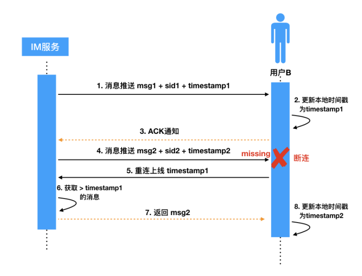

> 需要说明的是，由于时间戳可能存在多机器时钟不同步的问题，所以可能存在一定的偏差，导致数据获取上不够精确。所以在实际的实现上，也可以使用全局的自增序列作为版本号来代替。  

## 时序性-消息序号生成器

#### 什么是消息时序性

即消息收发的一致性。如果不能保证时序一致性，就会造成聊天语义不连贯，引起误会。

对于点对点的聊天场景，时序一致性保证接收方的接收顺序和发送方的发出顺序一致；对于群聊场景，时序一致性保证所有接收人看到的消息展现顺序一致。

#### 消息时序性的难点

1.多发送方、多接收方、服务端多线程并发处理情况下，无法保证时序一致性。

2.分布式环境下，多个机器的本地时钟不一致，没有“全局时钟”，不能用“本地时间”保证时序的一致性。

#### “全局序号生成器”作为“时序基准”

**为什么不以客户端（发送方）的本地序号/本地时钟作为“时序基准”？**

如果以发送方的本地时钟作为时序基准，发送方发送消息时，将消息本身和本地的时间戳或一个本地维护的序号发送到IM服务端，IM服务端再将这个消息和时间戳或序号发送给消息接收方，消息接收方根据这个时间戳或序号进行排序。

若发送方随时调整时钟，会导致时间戳回退；若发送方重装应用，会导致序号清零，从而回退。

而针对多发送方场景，如群聊和多点登录，存在同一时钟的==某个时间点、多条消息发送给同一接收对象==的可能。比如一个群聊内，用户A先发言、用户B后发言，但如果用户A的时钟比用户B的时钟慢，已发送方的本地时钟作为“时序基准”就会出问题；再比如微信在手机、电脑上同时登录，两台设备可以给某一接收方发送消息；若设备的本地时钟不一致，接收方可能会出现消息不连贯的问题。

**为什么不以服务器的本地时钟作为“时序基准”？**

如果以IM服务器的本地时钟作为时序基准，发送方将消息发送到IM服务端，IM服务端依据自身服务器的时钟生成一个时间戳，然后将消息和时间戳一起发送给消息接收方，消息接收方根据这个时间戳进行排序。
一旦IM服务集群化部署，就会出现多台服务器本地时钟不一致的问题。虽然多台服务器可以通过NTP时间同步服务，但依然存在一定的时间误差。

==将“全局序号生成器”作为“时序基准”==，可以解决每条消息没有标准“生产日期”的问题，按着实现方式可以分为两类，一是==支持单调自增序号的生成==，如Redis的原子自增命令incr、MySQL的自增ID，二是==分布式时间相关的ID生成==，如snowflake算法、时间相关的分布式序号生成服务等。
对于群聊和多点登录的场景，只需要保证一个群的消息有序即可，无需全局的跨多个群的绝对时序性。每个群聊有其独立的“ID生成器”，可以通过哈希规则路由到对应的主库实例上，降低多个群聊共用一个“ID生成器”的压力。

#### 消息整流

当 IM 服务端接收到消息后，若 IM 服务器是集群化部署，可能因为服务器性能的差异，导致后收到的消息先发出去；又或者多线程处理消息的流程不能保证先到达的消息先发送出去，从而使接收方收到的消息顺序有误，因此需要==消息整流==。消息整流又分为服务端包内整流和客户端（接收方）整流。

**服务端包内整流**

比如实现离线推送，当用户上线，网关机会通知业务层用户已上线，业务层就会把该用户的多条离线消息 pub 给这个网关机的 Topic，网关机再把收到的多条消息通过长连接推送给用户。

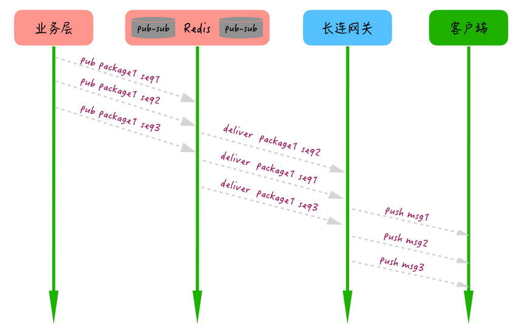

1. 生产者为每个消息包生成一个packageID，为包内的每条消息加个有序自增的seqID（注：这里的seqID和推送时的SeqID不是一个概念，这是的seqID只是当前这个包的序号，推送时不用看这个）；
2. 消费者根据每条消息的packageID 和 seqID 进行整流和排序；
3. 执行模块只有在一定超时时间内完整有序地收到所有消息才执行最终操作，否则根据业务需要触发重试或直接放弃操作。

**消息接收端整流**

1. 发送方发送消息时，连同消息和序号一起发送给接收方；
2. 接收方接收到消息后，先去查找上一条消息的序号，然后比对收到的序号和上一条消息的序号；
3. 如果收到的消息序号大于上一条消息序号，直接追加；反之则去查找小于该序号的最大消息序号，并追加到其后

消息时序一致性还可以参考：[消息“时序”与“一致性”为何这么难？](https://mp.weixin.qq.com/s/_853zUkO9uPnirHzCQoVyw)

## 安全性-HttpDNS和TLS

### 消息安全的三个维度

1. 传输安全
2. 内容安全
3. 存储安全

### 保证消息传输安全性

#### 保证访问入口安全：HttpDNS

**原因1：路由器的DNS设置被篡改**

> 这种问题常见于一些家用宽带路由器，由于安全性设置不够（比如使用默认密码），导致路由器被黑客或木马修改了，DNS 设置为恶意的 DNS 地址，这些有问题的 DNS 服务器会在你访问某些网站时返回仿冒内容，或者植入弹窗广告等  

**原因2：运营商LocalDNS被劫持**

什么是LocalDNS

> LocalDNS 是部分运营商为了降低跨网流量，缓存部分域名的指向内容，把域名强行指向自己的内容缓存服务器的 IP 地址

劫持原因

1、运营商可能会修改 DNS 的 TTL(Time-To-Live，DNS 缓存时间)，导致 DNS 的变更生效延迟，影响服务可用性。
时。
2、一些小运营商为了减轻自身的资源压力，把 DNS 请求转发给其他运营商去解析，这样分配的 IP 地址可能存在跨运营商访问的问题，导致请求变慢甚至不可用  

**解决DNS被篡改**

一般，我们会重置一下路由器的配置，然后修改默认的路由管理登录密码，基本上都能解决  

**解决LocalDNS被劫持**

采用HttpDNS方案，HttpDNS 绕开了运营商的 LocalDNS，通过 HTTP 协议（而不是基于 UDP 的 DNS 标准协议）来直接和 DNS 服务器交互，能有效防止域名运营商劫持的问题 。

由于 HttpDNS 服务器能获取到真实的用户出口 IP，所以能选择离用户更近的节点进行接入，或者一次返回多个接入 IP，让客户端通过测速等方式选择速度更快的接入 IP，因此整体上接入调度也更精准  

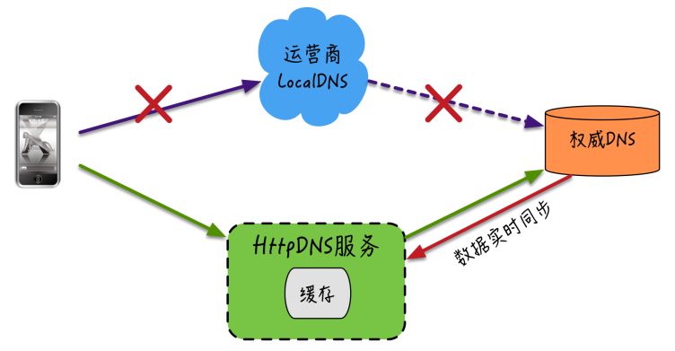

图解：由于 HttpDNS 服务器能获取到真实的用户出口 IP，所以能选择离用户更近的节点进行接入，或者一次返回多个接入 IP，让客户端通过测速等方式选择速度更快的接入 IP，因此整体上接入调度也更精准  

#### 保证传输链路安全：TLS 传输层加密协议

**消息传输链路的几种隐患**

1. 中断，攻击者破坏或者切断网络，破坏服务可用性
2. 截获，攻击者非法窃取传输的消息内容，属于被动攻击
3. 篡改，攻击者非法篡改传输的消息内容，破坏消息完整性和真实语义
4. 伪造，攻击者伪造正常的通讯消息来模拟正常用户或者模拟 IM 服务端

**中断**

采取多通道方式来提升链路可用性（failover）

1. 从 HttpDNS 服务返回的多个“接入 IP”中选择性进行切换，防止某一个“接入IP”的中间链路被破坏  
2. 从当前数据传输协议切换到其他传输协议，比如从基于 UDP 协议的 QUIC 协议切换到基于 TCP 协议的私有协议；或者针对 TCP 的私有协议提供 HTTP Tunnel 来对数据进行二次封装（微博目前支持这种方式），防止某些针对特定协议的中断攻击 

**截获、篡改、伪造 **

1. 私有协议
2. TLS协议

> TLS 巧妙地把“对称加密算法”“非对称加密算法”“秘钥交换算法”“消息认证码算法”“数字签名证书”“CA 认证”进行结合，有效地解决了消息传输过程中的截获、篡
> 改、伪造问题  

### 保证消息存储安全性

#### 账号密码存储安全：“单向散列”算法

针对账号密码的存储安全一般比较多的采用“高强度单向散列算法”（比如：SHA、MD5算法）和每个账号独享的“盐”（这里的“盐”是一个很长的随机字符串）结合来对密码原文进行加密存储（即：原密码+盐构成一个新字符串，再将散列算法作用于新字符串）

==当然，如果“密文”和“盐”都被黑客获取到，这些方式也只是提升破解成本，并不能完全保证密码的安全性。因此还需要综合从网络隔离、DB 访问权限、存储分离等多方位综合防治==

#### 消息内容存储安全：端到端加密

针对消息内容的存储安全，如果存储在服务端，不管消息内容的明文或者密文都存在泄漏的风险。因此保证消息内容存储安全的最好方式是  

1. 消息内容采用“端到端加密”（E2EE），中间任何链路环节都不对消息进行解密。
2. 消息内容不在服务端存储  

采用“端到端加密”方式进行通信（WhatsApp、Telegram），除了收发双方外，其他任何中间环节都无法获取消息原文内容，即使是研发者也做不到“破解”并且获取数据，顶多停止这种加密方式  

### 消息内容安全性

1. 建立敏感词库，针对文字内容进行安全识别
2. 依托图片识别技术来对色情图片和视频、广告图片、涉政图片等进行识别处置
3. 使用“语音转文字”和 OCR（图片文本识别）来辅助对图片和语音的进一步挖掘识别
4. 通过爬虫技术来对链接内容进行进一步分析，识别“风险外链”

一般来说，针对内容安全的识别的方式和途径很多，也有很多成熟的第三方 SaaS 服务可以接入使用

==对于 IM 服务端来说，更多要做的是要建立和“识别”配套的各种惩罚处置机制，比如：识别到群里有个别人发色情视频或者图片，可以联动针对该用户进行“禁言处理”，如果一个群里出现多人发违规视频，可以针对该群“禁止发多媒体消息”或者进行“解散群”等操作。具体处置可以根据业务需要灵活处理。== 

## 心跳机制

为了保持长连接高可用

### 降低服务端连接维护的开销

==针对每一台上线的设备，都会在 IM 服务端维护相应的“用户设备”和“网络连接”这么一个映射关系==

> 用户拿着手机进电梯了，手机网络信号忽然完全没了，长连接此时已经不可用，但
> IM 服务端无法感知到这个“连接不可用”的情况；另外，假如我们上网的路由器忽然掉线
> 了，之前 App 和 IM 服务端建立的长连接，此时实际也处于不可用状态，但是客户端和
> IM 服务器也都无法感知。  

1. IM 服务端可能维护了大量“无效的连接”，从而导致严重的连接句柄的资源浪费
2. 缓存了大量实际上已经没有用了的“映射关系”“设备信息”“在线状态”等信息，也是对资源的浪费  
3. IM 服务端在往“无效长连接”推送消息，以及后续的重试推送都会降低服务的整体性能  

### 支持客户端断线重连

对于客户端发出心跳包，如果在一定的超时时间内（考虑到网络传输具有一定的延迟性，这个超时时间至少要大于一个心跳的间隔），比如连续两次发送心跳包，都没有收到 IM 服务端的响应，那么客户端可以认为和服务端的长连接不可用，这时客户端可以断线重连。

### 连接保活

尽量让建立的长连接活得更久

**在用户网络和中间路由网络都正常的情况下，长连接还可能会被杀死**  

1. IPv4 的公网 IP 的资源有限性（约 43 亿个），为了节省公网 IP 的使用，通过移动运营商上网的手机实际上只是分配了一个运营商内网的 IP  
2. IPv4 的公网 IP 的资源有限性（约 43 亿个），为了节省公网 IP 的使用，通过移动运营商上网的手机实际上只是分配了一个运营商内网的 IP 
3. NAT 本身的实现机制并没有什么不妥，问题在于很多运营商为了节省资源和降低自身网关的压力，对于一段时间没有数据收发的连接，运营商会将它们从 NAT 映射表中清除掉，而且这个清除动作也不会被手机端和 IM 服务端感知到
4. 每个地方的运营商也是不尽相同，从几分钟到几小时都有  
5. 在没有消息收发的空闲时间给服务端发送一些信令，就能避免长连接被运营商 NAT 干掉了，这些“信令”一般就是通过心跳包来实现  

### 心跳检测的几种实现方式  

#### TCP Keepalive  

1. 操作系统会在连接空闲期按一定的频次，自动发送不携带数据的探测报文，来探测对方是否存活。操
   作系统默认是关闭这个特性的，需要由应用层来开启  
2. 默认的三个配置项：心跳周期是 2 小时，失败后再重试 9 次，超时时间 75s。三个配置项
   均可以调整  

**缺点**

1. 灵活性较差：一台服务器一段固定时间只能调整为固定间隔的心跳

2. TCP Keepalive 虽然能够用于连接层存活的探测，但并不代表真正的应用层处于可用状态  

   > 比如 IM 系统出现代码死锁、阻塞的情况下，实际上已经无法处理业务请求了，但此时连接层 TCP Keepalive 的探针不需要应用层参与，仍然能够在内核层正常响应。这种情况就会导致探测的误判，让已失去业务处理能力的机器不能被及时发现  

#### 应用层心跳

应用层心跳实际上就是客户端每隔一定时间间隔，向 IM 服务端发送一个业务层的数据包告知自身存活  

==不仅仅代表网络可用==

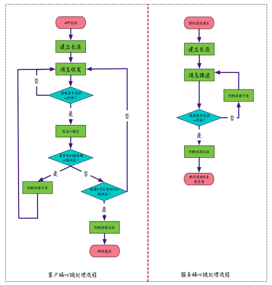

==考虑到网络数据传输有一定的延迟，因此判断连接是否空闲的超时时间需要大于心跳间隔时间，这样能避免由于网络传输延迟导致连接可用性的误判==

#### 智能心跳

> 采用固定频率的应用层心跳在实现上虽然相对较为简单，但为了避免 NAT 超时，只能将心跳间隔设置为小于所有网络环境下 NAT 超时的最短时间，虽然也能解决问题，但对于设备 CPU、电量、网络流量的资源无法做到最大程度的节约  
>
> 所谓智能心跳，就是让心跳间隔能够根据网络环境来自动调整，通过不断自动调整心跳间隔的方式，逐步逼近 NAT 超时临界点，在保证 NAT 不超时的情况下尽量节约设备资源。据说微信就采用了智能心跳方案来优化心跳间隔。  

==心跳机制中可以结合 TCP 的 keepalive 和应用层心跳来一起使用==

## 分布式一致性：消息多终端漫游

==多终端漫游”是指：用户在任意一个设备登录后，都能获取到历史的聊天记录，漫游几天就能获取几天前的历史记录==

### 设备维度的在线状态

对于在多个终端同时登录并在线的用户，可以让 IM 服务端在收到消息后推给接收方的多台设备，也推给发送方的其他登录设备。这样的话，就要求能够按照用户的设备维度来记录在线状态，这个其实也是支持多端登录的一个前提。  

### 离线消息存储

**多端在线收发消息**

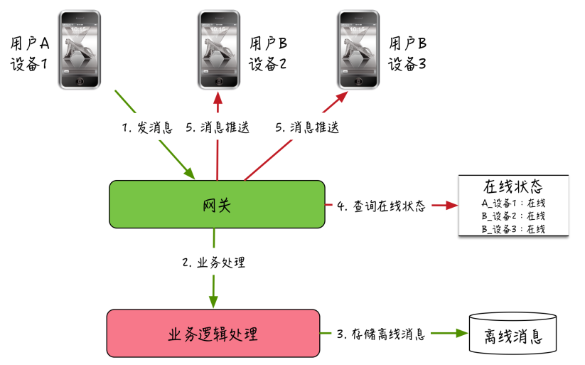

**离线设备上线同步消息**

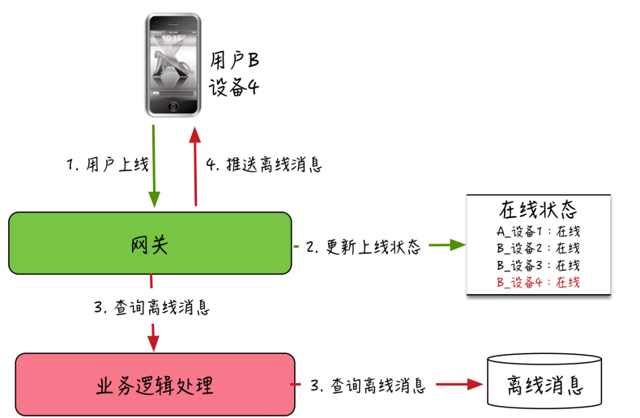

### 离线消息同步的几个关键点

**消息怎么存？**

1. 对于离线消息的存储，不仅仅需要存储消息，还需要存储一些操作（撤回、消息同步等）
2. 此外，还有一个需要考虑的点，离线消息的存储成本是比较高的，而我们并不知道用户到底有几个设备，因此离线消息的存储一般都会有时效和条数的限制，比如保留 1 周时间，最多存储 1000 条，这样如果用户一台设备很久不登录然后某一天再上线，只能从离线消息存储中同步最近一周的历史聊天记录  

**多端消息同步机制**

由于不知道有多少个终端获取消息，所以在一个终端同步完离线消息后，并不会从离线存储中删除这些消息，而是继续保留以免后续还有该用户的其他设备上线拉取，离线消息的存储也是在不超过大小限制和时效限制的前提下，采用 FIFO（先进先出）的淘汰机制  

这样的话用户在使用某一个终端登录上线时，需要知道应该获取哪些离线消息，否则将所有离线都打包推下去，就会造成两种问题：

1. 浪费流量资源
2. 消息重复出现和信令被重复执行的问题

一种常见的方案是采用版本号来实现多终端和服务端的数据同步：

> 每个用户拥有一套自己的版本号序列空间。
> 每个版本号在该用户的序列空间都具备唯一性，一般是 64 位。
> 当有消息或者信令需要推送给该用户时，会为每条消息或者信令生成一个版本号，并连同消息或者信令存入离线存储中，同时更新服务端维护的该用户的最新版本号。
> 客户端接收到消息或者信令后，需要更新本地的最新版本号为收到的最后一条消息或者信令的版本号。
> 当离线的用户上线时，会提交本地最新版本号到服务端，服务端比对服务端维护的该用户的最新版本号和客户端提交上来的版本号，如不一致，服务端根据客户端的版本号从离线存储获取“比客户端版本号新”的消息和信令，并推送给当前上线的客户端。  

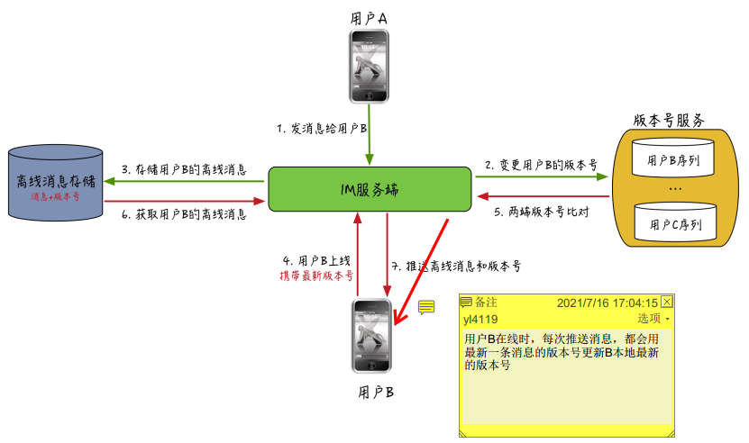

**消息打包下推和压缩**

对于较长时间不上线的用户，上线后需要拉取的离线消息比较多，如果一条一条下推会导致整个过程很长，客户端看到的就是一条一条消息蹦出来，体验会很差。因此，一般针对离线消息的下推会采用整体打包的方式来把多条消息合并成一个大包推下去，同时针对合并的大包还可以进一步进行压缩，通过降低包的大小不仅能减少网络传输时间，还能节省用户的流量消耗  

**发送方设备的同步问题**

另外还有一个容易忽视的问题，版本号机制中，我们在下推消息时会携带每条消息的版本号，然后更新为客户端的最新版本号。而问题是发送方用于发出消息的设备本身已经不需要再进行当前消息的推送，没法通过消息下推来更新这台设备的最新版本号，这样的话这台设备如果下线后再上线，上报的版本号仍然是旧的，会导致 IM 服务端误判而重复下推已经存在的消息。

针对这个问题，一个比较常见的解决办法是：给消息的发送方设备仍然下推一条只携带版本号的单独的消息，发送方设备接收到该消息只需要更新本地的最新版本号就能做到和服务端的版本号同步了（这也就是3x中同步消息`carbon`字段存在的原因）。

参考：[https://www.cnblogs.com/sunshineliulu/tag/IM%E6%8A%80%E6%9C%AF%E5%89%96%E6%9E%90%E4%B8%8E%E5%AE%9E%E6%88%98/](https://www.cnblogs.com/sunshineliulu/tag/IM技术剖析与实战/)
